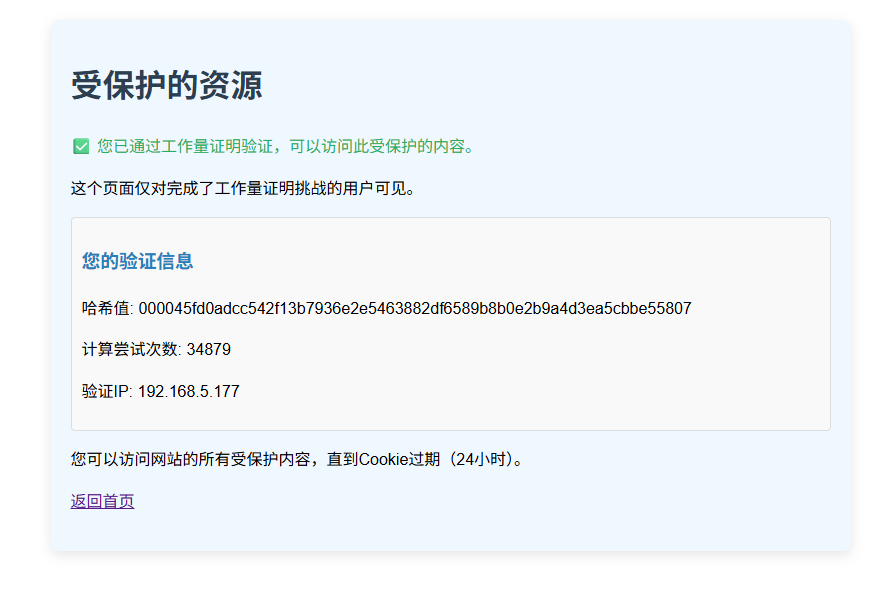

# 这是一个工作量证明系统的demo

## 使用区块链原理开发的简易工作量证明系统

1、给前置页面发放一个依据当前ip地址和时间计算出来的hash。

2、要求前置页面根据这个hash计算符合难度的hash。

3、使用这个hash值提交验证获得授权session

4、这样访问者需要消耗比服务器多几万倍到100万倍的计算量，从而抵御DDoS攻击

## 简单例子说明工作原理
[点击查看](./docs/example.html)


## 如何运行：
```sh
pnpm install
pnpm dev
```

### 浏览器访问
http://127.0.0.1:3000

这个时候你将看到会自动跳转到一个loading开始计算，验证成功后会自动返回到首页

### 验证中


### 验证成功
